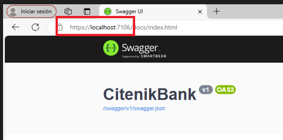

# <Citenik-Bank-Backend>

## Índice

- [Descripción](#descripción)
- [Funciones](#funciones)
- [Instalación](#instalación)
- [Uso](#uso)
- [Créditos](#créditos)
- [Licencia](#licencia)
- [Insignias](#insignias)

## Descripción

CitenikBank es un proyecto de formación profesional desarrollado para una pasantía laboral que busca **simular el ejercició de una plataforma de negocios virtual** 
como lo es un banco. Para esto, se desarrollo un **sistema de gestión capaz de permitir la creación, simulación y otorgamiento de prestamos en línea** a clientes previamente registrados en la plataforma. 

Dentro de este repositorio encontraremos todo lo relacionado con el **backend** de CitenikBank, el cual fue desarrollado haciendo uso de **.NET 6.0**.

## Funciones

El proyecto cuenta con diferentes API's las cuales nos van a permitir llevar a cabo algunas funciones como:
* Registro, Modificación y Baja de Clientes.
* Registro, Modificación y Baja de Prestamos.
* Otorgamiento de Prestamos a Clientes registrados previamente.
* Simulación de Cuotas a pagar.
* Pago virtual de Cuota.

## Instalación

Para poder hacer uso del sistema será necesario contar con lo siguiente:

* Visual Studio Community 2022: https://visualstudio.microsoft.com/es/downloads/ 
* .NET 6.0: https://dotnet.microsoft.com/es-es/download/dotnet/6.0
* Cualquier herramienta visual que permita levantar una Base de Datos MySQL: https://dbeaver.io/download/

## Uso

Para poder hacer uso del proyecto, será necesario realizar la conexión con la Base de Datos de CitenikBank. Para esto, es necesario tener clonado de manera local
el repositorio <Nombre del Repo>. Una vez clonado, tendrémos que dirigirnos al archivo appsettings.json, ubicado dentro de la carpeta app del proyecto, y allí realizar
una serie de cambios.

  

Una vez dentro del archivo appsettings.json tendremos que configurar la conexión con la base de datos local anteriormente clonada. Para eso, deberemos completar la siguiente línea de código:

>  "mySQLConnection": "server=[ip del servidor]; port=3306;user=[nombre de usuario];password=[contraseña de usuario];database=[nombre de la base de datos]"

Ya realizada esta configuración, lo único que resta antes de poder hacer uso de las diferentes API's del sistema es corroborar el puerto en el que se encuentra
corriendo la aplicación de Swagger. Para esto ejecutaremos el sistema y observaremos el puerto que este nos índica

  

Ya finalizadas estas dos configuraciones, el sistema se encuentra listo para ser utilizado.

## Crédito

Este proyecto fue desarrollado por: 
* Karen Yamila Cruz 
* Ramiro Carreño
* Fontal Santiago

Juntos, llevamos a cabo varios de los roles los que uno se encuentra comunmente dentro del ambito de desarrollo de software. De esta manera, podemos decir que realizamos
desde el lado técnico realizamos tareas de **desarrollador de software**, como así también de **gestor de base de datos**. A su vez, realizamos pruebas, observando el trabajo que debería
desarrollar un **analista de calidad**. Por otro lado, también realizamos algunas tareas de gestión, en donde tuvimos que hacer un análisis y refinamiento de los requerimientos solicitados por el cliente. Es aquí donde desempeñamos el papel de **analistas funcionales**

## Licencia

MIT License

Copyright (c) [2024] [CitenikBank]

Permission is hereby granted, free of charge, to any person obtaining a copy
of this software and associated documentation files (the "Software"), to deal
in the Software without restriction, including without limitation the rights
to use, copy, modify, merge, publish, distribute, sublicense, and/or sell
copies of the Software, and to permit persons to whom the Software is
furnished to do so, subject to the following conditions:

The above copyright notice and this permission notice shall be included in all
copies or substantial portions of the Software.

THE SOFTWARE IS PROVIDED "AS IS", WITHOUT WARRANTY OF ANY KIND, EXPRESS OR
IMPLIED, INCLUDING BUT NOT LIMITED TO THE WARRANTIES OF MERCHANTABILITY,
FITNESS FOR A PARTICULAR PURPOSE AND NONINFRINGEMENT. IN NO EVENT SHALL THE
AUTHORS OR COPYRIGHT HOLDERS BE LIABLE FOR ANY CLAIM, DAMAGES OR OTHER
LIABILITY, WHETHER IN AN ACTION OF CONTRACT, TORT OR OTHERWISE, ARISING FROM,
OUT OF OR IN CONNECTION WITH THE SOFTWARE OR THE USE OR OTHER DEALINGS IN THE
SOFTWARE.

---

## Insignias

